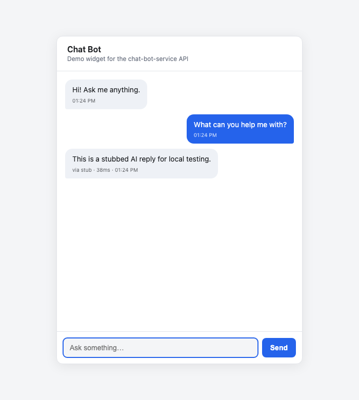
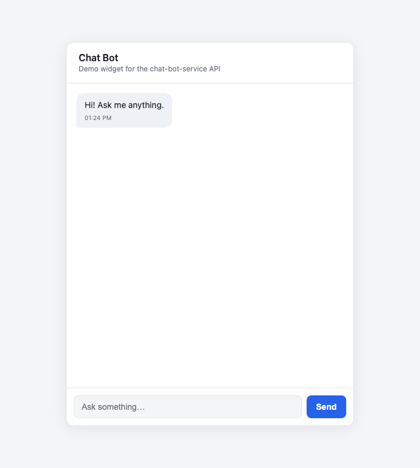
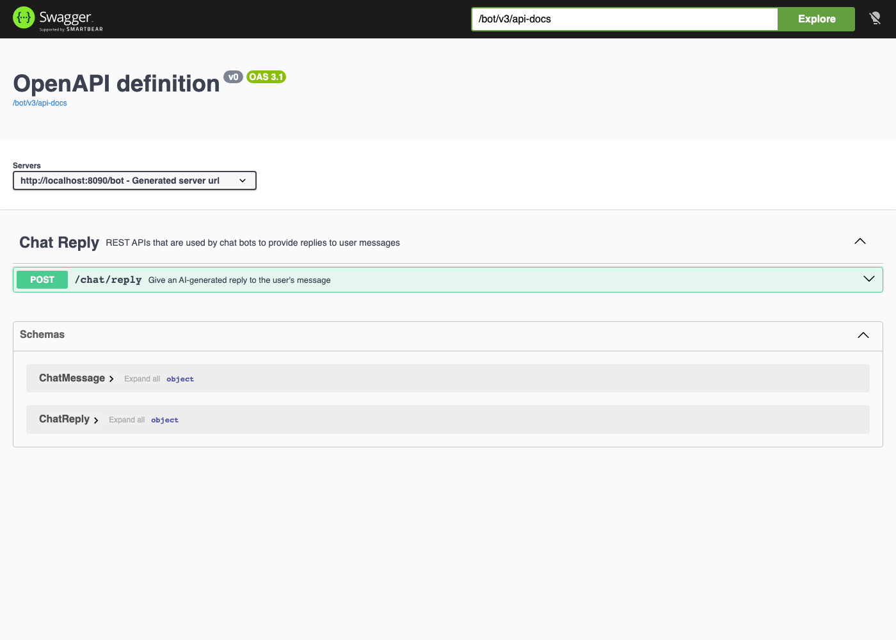
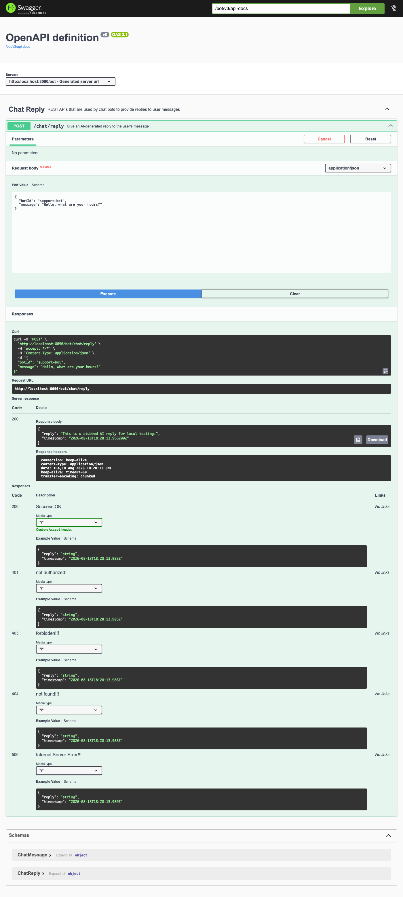
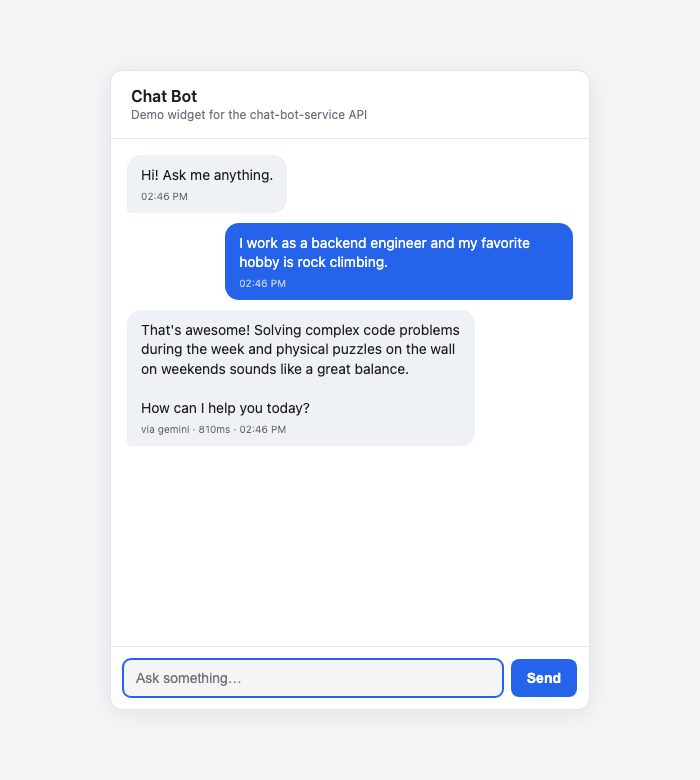

# chat-bot-service

A self-hostable Spring Boot microservice that gives AI-generated chat replies, routed across several free-tier LLM providers (Gemini, Groq, Mistral, OpenRouter) via Spring AI so it can run at zero API cost. It remembers a conversation (Redis + Postgres), can call a handful of tools mid-reply (weather, time, directions, web search), streams replies token-by-token over SSE, and is hardened for public exposure (rate limiting, request limits, optional API-key auth). Ships with a minimal static chat widget for trying it out in a browser, and exposes its REST API via Swagger/OpenAPI for a real front-end app to integrate against.

**Contents:** [Tech stack](#tech-stack) · [Getting started](#getting-started) · [Running the application](#running-the-application) · [Chat widget](#chat-widget) · [Testing](#testing) · [API](#api) · [Security](#security) · [Conversation memory](#conversation-memory) · [Tools](#tools) · [Deployment](#deployment)

## Tech stack

| Category | Technologies |
|---|---|
| Frameworks | Spring Boot 4.1 · Spring AI (multi-provider, free-tier-first) · Resilience4j · springdoc-openapi |
| Data | Postgres (durable user facts, via Flyway) · Redis (conversation memory, quota/rate-limit counters) |
| Testing | JUnit · Mockito · Testcontainers · WireMock |
| Infrastructure | Docker · Maven · Render (app) · Neon (Postgres) · Upstash (Redis) |
| Languages | Java 21 · Bash |

## Getting started

**Prerequisites:** Maven, Java 21, Docker (for Postgres/Redis, see below).

For real (non-stubbed) replies, set at least one free-tier provider's API key as an environment variable before starting the application — see [.env.example](.env.example) for the full list, where to get each one for free, and every other environment variable the app reads:

```bash
export GEMINI_API_KEY=...
```

With no key set at all, the app still boots and responds, just with a canned fallback reply instead of a real one (see [Live testing without an API key](#live-testing-without-an-api-key) below for a cost-free way to exercise the full request flow).

The default profile also requires Postgres and Redis to be reachable at boot (`spring-boot-starter-data-jpa`/`-data-redis` back conversation memory, see below). The quickest way to get both locally is `docker-compose up -d postgres redis`. The cost-free `local` profile below needs neither.

## Running the application

**Option 1 — Docker Compose.** After cloning, from the project directory:

```bash
cp .env.example .env   # fill in whichever keys you have
sh start.sh
```

This runs the test suite, builds a Docker image, and starts the full stack (app + Postgres + Redis) via `docker-compose`, which reads `.env` automatically.

**Option 2 — From an IDE.** Start Postgres and Redis (`docker-compose up -d postgres redis`), import the project (Maven), build it, and set whichever provider key(s) you have (and, if `5432`/`6379` are already taken locally, `DB_HOST_PORT`/`REDIS_HOST_PORT`) in the run configuration's environment variables before running `ChatBotService`.

Once running, the service listens on `http://localhost:8080/bot`.

## Chat widget

A minimal static chat widget ([src/main/resources/static/index.html](src/main/resources/static/index.html)) is served by the same application at `http://localhost:8080/bot/`. It's a single self-contained HTML page — no build step, no separate frontend project — that streams replies via `POST /chat/reply/stream` and renders them token-by-token as they arrive.



The meta line under each reply names which `ChatProvider` actually answered and how long it took — the multi-provider failover/circuit-breaker/quota system described in the tech stack above is otherwise invisible behind a plain chat box, so this surfaces it live:



It's meant as a quick way to try the bot in a browser, not as a production UI. Both `/chat/reply` and `/chat/reply/stream` remain fully documented via Swagger/OpenAPI (see below) so a real, separately-hosted front end can integrate against either directly.

The widget can also be deployed on its own, separate from the backend (e.g. to Vercel) — see [docs/DEPLOY_WIDGET.md](docs/DEPLOY_WIDGET.md). Once split across two origins like that, the backend needs `CHATBOT_CORS_ALLOWED_ORIGINS` set to the widget's origin (see [.env.example](.env.example)); same-origin (the default, widget served by this app) needs no CORS configuration at all.

## Testing

### Unit tests

```bash
mvn test
```

Covers the controller, service, and utility layers (`src/test/java`).

### Live testing without an API key

A `local` Spring profile is provided so you can exercise the full HTTP flow — validation, controller, service, circuit breaker — without any provider API key and without incurring any cost. It swaps in a stubbed [`StubChatProvider`](src/main/java/com/mel/cb/provider/StubChatProvider.java) that returns a canned reply instead of calling a real provider.

```bash
mvn spring-boot:run -Dspring-boot.run.profiles=local
```

By default this runs on port `8090` (configurable via `server.port` in [application-local.yml](src/main/resources/application-local.yml), useful if `8080` is already taken locally). No Postgres or Redis needed either — the `local` profile disables their autoconfiguration too.

Then either open the chat widget at `http://localhost:8090/bot/` and type a message, or use Swagger UI to try the endpoint directly:

`http://localhost:8090/bot/swagger-ui.html`



Expand `POST /chat/reply`, click **Try it out**, submit a payload, and hit **Execute**:

```json
{
  "botId": "support-bot",
  "userId": "user-123",
  "message": "Hello, what are your hours?"
}
```



### Live testing with real replies

Run without the `local` profile (i.e. `mvn spring-boot:run`) with at least one provider key set, then hit the endpoint directly:

```bash
curl -X POST http://localhost:8080/bot/chat/reply \
  -H "Content-Type: application/json" \
  -d '{"botId": "support-bot", "userId": "user-123", "message": "Hello, what are your hours?"}'
```

or use Swagger UI at `http://localhost:8080/bot/swagger-ui.html` the same way as above.

## API

### `POST /chat/reply`

Receives a bot identifier and the user's message, sends the message to whichever configured LLM provider is next in priority (via Spring AI), along with a configurable system prompt (`chatbot.system-prompt`), and returns the model's generated reply.

**Edge cases handled:**

- If the call to the LLM provider takes longer than 60 seconds, or every provider fails, a Resilience4j circuit breaker trips and a default reply is returned instead of hanging the request. 60s accommodates a full tool-calling round trip (initial call + tool execution + follow-up call), which can legitimately take that long on some free-tier providers.
- If the input payload has a missing/blank bot identifier, user id, or message, or the message exceeds 4000 characters, a 400 client error is thrown from the endpoint.
- All other exceptions are wrapped into user-friendly exceptions with appropriate messages.

**Response model (`ChatReply`):**

- `reply` — the chat reply text. Falls back to a default message if the AI call fails or the circuit breaker trips.
- `timestamp` — ISO 8601 format with fractional seconds, human-readable and chronologically sortable.
- `conversationId` — identifies the conversation for follow-up turns. Echoed back if the request included one, otherwise a new id is minted and returned here — pass it back on the next request to continue the same conversation (see [Conversation memory](#conversation-memory)).
- `provider` — id of the `ChatProvider` that actually answered (e.g. `gemini`, `groq`), surfacing the multi-provider failover/circuit-breaker routing described in the tech stack above. `null` for the circuit breaker's canned fallback, since no provider ever replied.
- `latencyMs` — how long that provider's call took, in milliseconds. `null` alongside `provider`.

### `POST /chat/reply/stream`

Same request body as `/chat/reply`, but streams the reply via Server-Sent Events (`text/event-stream`) as it's generated instead of waiting for the full response. Not `EventSource`-compatible by design (`EventSource` can't `POST` a JSON body) — consume it with `fetch()` and read `response.body` as a stream, as the widget does.

- First event, named `conversation`: the conversation id (always sent, even for a brand-new conversation — there's no response header for it, since a streaming controller method returning `SseEmitter` doesn't expose one).
- Second event, named `provider`: `<providerId>|<latencyMs>`, sent once the winning provider's first chunk arrives — `latencyMs` here is time-to-first-token rather than a full round-trip, since the reply is still streaming out. Names whichever provider's output actually reached the client, which per the failover behavior below isn't necessarily the first one attempted.
- Each following (default-named) event: one text chunk to append to the reply so far.
- On failure, a final event named `error` with a user-facing message, then the stream closes normally.

Provider selection happens once, before the first token — a provider that fails after streaming has started is not retried, unlike `/chat/reply`'s per-request failover (see `docs/PLAN.md` Phase 4 notes for why). There's also no circuit-breaker timeout on this endpoint the way `/chat/reply` has (see above), since a streamed reply can legitimately take longer to finish; it does have its own, longer-lived 60s connection timeout at the transport level.

## Security

`/chat/**` is hardened for public exposure with a few lightweight, independently-configurable layers (see `chatbot.security` in [application.yml](src/main/resources/application.yml) and `docs/PLAN.md` Phase 5 notes). All are safe defaults out of the box — a from-scratch self-host still boots and works with nothing configured here:

- **Request size limit** — a request over 8 KB is rejected with `413` before its body is parsed; the 4000-character `message` cap above is a second, independent check on the parsed value.
- **Rate limiting** — 20 requests/minute per client IP (`X-Forwarded-For` if present, else the socket address); a client over that limit gets `429` with `Retry-After: 60`. This is separate from each LLM provider's own daily quota tracking done further downstream — it protects this service's own front door, not the providers behind it.
- **API key auth** — set `CHATBOT_API_KEY` and every `/chat/**` request must include a matching `X-API-Key` header, or it's rejected with `401`. Unset (the default) means no auth check at all — a startup log warns when this is the case. This is a single shared secret between your own client(s) and the API, not per-user auth; a publicly-hosted static widget baking this key into its page source can't keep it secret from a visitor who views source, only from anonymous scripts/bots and other origins (still gated by `CHATBOT_CORS_ALLOWED_ORIGINS`).
- **Security response headers** — `X-Content-Type-Options`, `X-Frame-Options`, `Referrer-Policy` on every response, plus `Cache-Control: no-store` on `/chat/**` replies.
- **Actuator** exposes `/actuator/health` (no details, unauthenticated — hosting platforms like Render need this reachable for their own health checks) and `/actuator/metrics` (per-endpoint request counts/latency, gated by the same `X-API-Key` check as `/chat/**`) over HTTP. Everything else is off by default.

## Conversation memory

Each conversation's recent turns and a rolling summary of older ones are kept in Redis for the length of a session (~8 hours of activity); the model sees them as real context on every reply, not just the latest message. Token usage is budgeted per user, split evenly across however many conversations that user currently has active — once a conversation nears its share, its oldest turns are summarised away to make room, and any durable facts spotted about the user (preferences, name, etc.) are extracted and saved to Postgres so they persist across sessions, long after the Redis-backed short-term memory above has expired.

**Retrieval is semantic, not exact-text.** Each saved fact is embedded (Gemini's `gemini-embedding-001`, 768 dimensions) and stored in a `vector` column via [pgvector](https://github.com/pgvector/pgvector) on the same Postgres database — no separate vector database. On every reply, the current message is embedded and the top-K most similar facts for that user are retrieved by cosine distance (pgvector's `<=>` operator) and injected into the prompt, regardless of word overlap with how the fact was originally phrased.

Proven end to end against a real Postgres+pgvector/Redis/Gemini stack, not mocked: a message revealing "I work as a backend engineer and my favorite hobby is rock climbing" gets extracted into two facts and embedded; a **brand-new conversation** with zero prior turns — asking only "Do you know anything about my job or my hobbies?" — correctly answers *"Yes! You're a backend engineer and you love rock climbing"*, sourced purely from the pgvector lookup (there is nothing else in that conversation's own history it could have come from). This also demonstrates the retrieval is provider-agnostic: the fact-saving turn was answered by Gemini, the recall turn by Groq — the facts are already in the prompt before `ProviderRouter` ever picks a provider.



## Tools

The model can call a few tools mid-conversation when it decides one would help answer the user's question:

| Tool | Needs a key? | Powered by |
|---|---|---|
| Current weather | No | [Open-Meteo](https://open-meteo.com) |
| Current time in a place | No | Open-Meteo (geocoding) |
| Travel directions (driving/cycling/walking — not live transit schedules) | Yes — `OPENROUTESERVICE_API_KEY` | [OpenRouteService](https://openrouteservice.org) free tier |
| Web search | Yes — `TAVILY_API_KEY` | [Tavily](https://tavily.com) free tier |

Weather and time work out of the box. Directions and web search are off until their key is set — see [.env.example](.env.example) for where to get a free one.

## Deployment

The app, its Postgres, and its Redis can each be hosted for free, separately:

| Piece | Target | Why |
|---|---|---|
| App | [Render](https://render.com) | Builds straight from the repo's own `Dockerfile` as a Web Service. |
| Postgres | [Neon](https://neon.tech) | Serverless Postgres with a permanent free tier (Render's own Postgres no longer has one). |
| Redis | [Upstash](https://upstash.com) | Serverless Redis with a permanent free tier (same reasoning as Neon). |

See [docs/DEPLOY_BACKEND.md](docs/DEPLOY_BACKEND.md) for the full walkthrough (env vars, health check
path, Neon/Upstash-specific config) and [render.yaml](render.yaml) for an optional Blueprint. The
widget can be deployed separately too (e.g. to Vercel) — see
[docs/DEPLOY_WIDGET.md](docs/DEPLOY_WIDGET.md). Both are live from this repo, not just documented:
the backend at https://chat-bot-service-06gv.onrender.com (`/bot` context path) and the widget at
https://chat-bot-service-rust.vercel.app, talking to each other cross-origin with CORS and API-key
auth both configured — see `docs/PLAN.md`'s "Widget deployed to Vercel" and "API key enforcement"
sections for how that was verified end to end.
