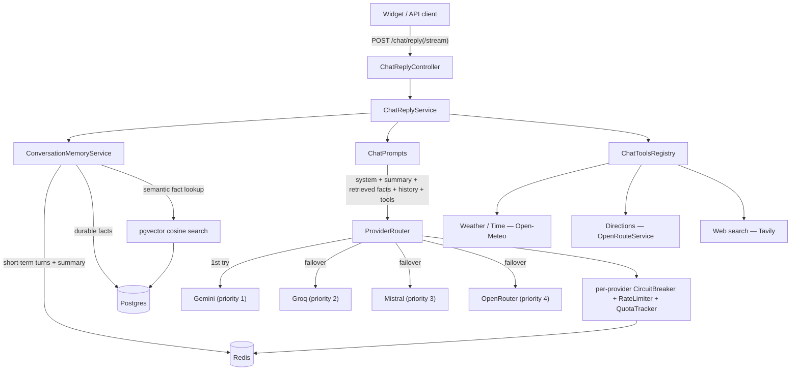

# Architecture & design decisions

This document explains *why* the service is built the way it is: the tradeoffs behind each major
decision, the mechanics of the parts that make it more than a thin wrapper around an LLM API, and a
few real bugs that only surfaced under live traffic — because the reasoning behind a design is more
useful to a reader than a restatement of the code.

**Contents:** [Goals](#goals) · [System overview](#system-overview) · [Multi-provider failover](#multi-provider-failover) · [Conversation memory: two tiers](#conversation-memory-two-tiers) · [Retrieval-augmented generation](#retrieval-augmented-generation-rag) · [Streaming](#streaming) · [Tool calling](#tool-calling) · [Security & observability](#security--observability) · [Testing philosophy](#testing-philosophy) · [Real bugs, found live](#real-bugs-found-live) · [What's genuinely "AI engineering" here](#whats-genuinely-ai-engineering-here) · [What I'd do next](#what-id-do-next)

## Goals

Most "I built a chatbot" projects are a thin HTTP wrapper around a single provider's SDK. This one
was built to demonstrate the engineering that sits *around* an LLM call in a real service:

- **Resilience** — one provider going down, rate-limiting, or being slow shouldn't mean the service
  is down.
- **Zero cost to run** — every LLM provider in the routing list is free-tier, so the resilience layer
  above has to actually earn its keep (failover isn't theoretical, it's the thing that keeps a
  demo-able service up when any one free tier gets exhausted).
- **Memory that behaves like memory** — short-term context should feel present in a conversation and
  then fade; long-term facts about a user should persist and be retrievable by *meaning*, not just
  exact text.
- **Provable, not just plausible** — every non-trivial claim in this document has a corresponding
  live test against the real service, not just a unit test against a mock. That distinction shows up
  repeatedly below.

## System overview

Every box above is independently swappable and independently tested: a provider is just an entry in
a config list, a tool is just a bean that self-disables without its API key, and the memory layer
no-ops cleanly when Redis/Postgres aren't present (the zero-infra `local` profile used for
stub-provider testing runs the exact same code paths with every optional collaborator simply absent).

## Multi-provider failover

`ProviderRouter` tries providers in priority order and fails over on *any* exception, not just
429/5xx — the reasoning is that a free-tier provider can fail in ways that don't fit a clean status
code (a flaky TLS handshake, a malformed response, a provider-specific quirk), and there's no reason
to sacrifice the whole request over a failure mode that happens not to match a status-code allowlist.
Each provider gets its own [Resilience4j](https://resilience4j.readme.io/) `CircuitBreaker` and
`RateLimiter`, built programmatically rather than via annotations, because the provider set is
config-driven (`chatbot.providers` in `application.yml`) rather than a fixed set of named beans —
adding a fifth free-tier provider is a YAML entry, not a code change.

A subtler failure mode that annotation-based/status-code-based failover would have missed entirely:
a provider can return a **200 with no usable content** (seen live with Gemini's tool-calling path —
see [Real bugs, found live](#real-bugs-found-live)). `ProviderRouter` treats an empty-but-successful
response the same as a thrown exception for failover purposes, because from the caller's perspective
they're indistinguishable failures.

Streaming gets a narrower version of the same idea: failover only happens *before* the first chunk
is emitted. Once output has started reaching the client, retrying would mean replaying or duplicating
partial text — worse than just ending the stream cleanly, which is what happens instead.

Which provider actually answered, and how long it took, is surfaced all the way to the client (the
`provider`/`latencyMs` fields on `ChatReply`, and a `provider` SSE event on the streaming endpoint) —
otherwise this entire layer is invisible behind a chat box. The widget shows it directly under every
reply (`via groq · 178ms`).

## Conversation memory: two tiers

Memory is deliberately split by how long it should live and what it's for:

- **Short-term (Redis)**: recent turns plus a rolling summary, on a *sliding* TTL (refreshed every
  turn, ~8h of inactivity to expire) — this is what makes a conversation feel coherent turn-to-turn.
  Token budget is tracked per user, split evenly across that user's currently-active conversations;
  once a conversation nears its share, its oldest turns are folded into the summary by an LLM call
  (`ConversationSummarizer`) to free space. Eviction frees space *even if* that summarization call
  fails or every provider is exhausted — the space-freeing guarantee can't depend on an LLM call
  succeeding.
- **Long-term (Postgres)**: durable facts extracted during that same fold step, meant to outlive the
  Redis session entirely. This is a different kind of memory — not "what did we just say" but "what
  do I know about this person" — and it's why it needed semantic retrieval rather than exact lookup
  (below).

## Retrieval-augmented generation (RAG)

Facts are embedded (`gemini-embedding-001`, 768 dimensions) and stored in a `vector` column added
directly to the existing `user_facts` table via [pgvector](https://github.com/pgvector/pgvector) —
deliberately not a separate vector database or a second table. The reasoning: this project already
has a Postgres instance for durable facts, per-user fact counts are small, and adding infrastructure
solely to hold vectors would be complexity the actual scale doesn't call for. (No ANN index either,
for the same reason — every query is scoped by `user_id` first via a plain B-tree, so an `ivfflat`/
`hnsw` index would be optimizing a lookup that's already fast.)

On every reply, the current message is embedded and the top-K most similar facts for that user are
retrieved by cosine distance (pgvector's `<=>` operator) and injected into the prompt as their own
system message — regardless of whether the current message shares any words with how the fact was
originally phrased. That's the actual point of embedding over exact-text matching: it's what lets a
fact stored as *"favorite hobby is rock climbing"* get retrieved by a query like *"what sport should
I try this weekend"*, where the only thing connecting them is meaning.

**Proven live, not asserted**: a message revealing a fact gets extracted and embedded; a **brand-new
conversation** with zero prior turns then correctly recalls it, sourced purely from the pgvector
lookup — verified independently at the SQL layer (re-running the exact cosine-distance query by hand
and confirming the ranking) and at the whole-app layer (a real chat reply that references the fact).
See `docs/screenshots/rag-memory-reuse.gif` for the recording. It also incidentally proves retrieval
is provider-agnostic: the fact-saving turn was answered by Gemini, the recall turn by Groq — the
facts are already in the prompt before `ProviderRouter` ever picks who answers.

## Streaming

`POST /chat/reply/stream` serves Server-Sent Events alongside the existing synchronous endpoint, not
as a replacement — a synchronous integration and a token-by-token UI have different needs, and there
was no reason to force every caller through one shape. Provider selection happens once, before the
first token (see the failover note above); the conversation id and provider-attribution metadata are
sent as their own named SSE events ahead of the text deltas, since `SseEmitter` doesn't expose custom
response headers to a controller returning it directly.

## Tool calling

The model can call a handful of functions mid-reply (current weather/time via the free, keyless
Open-Meteo API; driving/cycling/walking directions via OpenRouteService; web search via Tavily) via
Spring AI's function-calling support. Each tool is a plain bean implementing a one-method `ChatTool`
marker interface with an `isEnabled()` check — a tool needing a key that isn't configured is left out
of the model's tool list entirely, rather than offered and failing when called. That's the same
"skip rather than offer-and-fail" principle `ProviderRouter` already applies to providers, reused for
tools rather than invented twice.

## Security & observability

Layered incrementally, all independently configurable and all defaulting to safe-but-open (a
from-scratch self-host still boots and works with nothing configured):

- Request size/shape limits (a pre-parse `Content-Length` check plus post-parse field validation)
- Per-client rate limiting, independent of each provider's own quota tracking — this protects the
  service's own front door regardless of which provider ends up handling a request
- Optional shared-secret API-key auth (`X-API-Key`, constant-time comparison), scoped to this
  project's actual threat model (a single-operator self-host, not multi-tenant auth)
- Security response headers and a locked-down Actuator surface (only `health` open by default;
  `/actuator/metrics` gated behind the same API key)
- Structured JSON logging plus a request-level access-log filter, so a real deployment's logs are
  actually queryable rather than a wall of unstructured text

## Testing philosophy

Every third-party integration (each LLM provider, the embeddings endpoint, every tool's API) is
tested against [WireMock](https://wiremock.org/) — real HTTP through the real client code, not a
mocked service class — because the actual bugs in this project (see below) live exactly in the gap
between "the client library's types compile" and "the real API behaves as documented." Redis and
Postgres get the same treatment via [Testcontainers](https://testcontainers.com/): real containers,
real protocol, real schema (including the Flyway-managed `vector` column pgvector needs). Provider/
service logic that doesn't need real infrastructure is plain JUnit + Mockito. The result is a test
suite that has repeatedly caught things a pure-mock suite structurally cannot.

## Real bugs, found live

A recurring theme in this project, worth stating plainly rather than glossing over: **"the SDK's
types compile" and "the docs say this is supported" are not the same as "this actually works,"** and
more than once here, only a real request against a real API surfaced the gap.

- **A tool-calling `ClassCastException`, live, on every single provider.** Spring AI's chat models
  accept generic `ChatOptions` at the type level; in practice, `OpenAiChatModel` hard-casts whatever
  options object is on the `Prompt` to its own concrete type with no merging, discovered by reading
  the decompiled source after the type-safe-looking code failed instantly against a real key. Fixed
  by baking tool callbacks into each provider's own default options at construction instead of
  attaching generic options at the prompt level.
- **Gemini's embeddings endpoint doesn't return what "OpenAI-compatible" implies.** The official
  OpenAI Java SDK's response model treats `index` and `usage` as required fields; Gemini's real
  response omits both entirely. Every embed call failed with an obscure SDK error until a raw HTTP
  call showed the actual response shape — fixed with a five-line hand-rolled `RestClient` call
  instead of trusting the "compatible" label.
- **CORS preflight silently broke the widget the moment API-key auth was turned on**, because the
  auth filter ran before Spring's CORS handling and a browser's automatic `OPTIONS` preflight never
  carries a custom header like `X-API-Key` — invisible to `curl`, which doesn't enforce CORS at all,
  and only caught by testing in an actual browser.
- **A provider could return a 200 with nothing useful in it** (a Gemini tool-calling quirk around a
  missing `thought_signature`), which no status-code-driven failover logic would ever catch — see
  [Multi-provider failover](#multi-provider-failover) above for the fix.

The common thread: verification against real traffic, not documentation or type signatures, is what
actually caught each of these — which is also why the test suite leans on WireMock/Testcontainers
rather than hand-written mocks wherever a third-party integration is involved.

## What's genuinely "AI engineering" here

Distinguishing this from "wired up a chat API": the multi-provider abstraction over several
non-identical "OpenAI-compatible" APIs, the two-tier memory design (what should be ephemeral vs.
durable, and why), a from-scratch RAG pipeline (embedding choice, chunking granularity at the
"fact" level rather than raw messages, retrieval strategy, and the judgment call to skip an ANN index
because the actual data scale doesn't need one), token-budget-aware context management, and
function-calling integration across providers with materially different tool-calling implementations
underneath a supposedly-uniform API shape.

## What I'd do next

In priority order, the things I'd add if this moved from portfolio project to production:

1. **Evaluation rigor** — a golden-dataset regression suite for reply quality and prompt versioning,
   so a prompt change is a measured decision rather than a shipped guess. This is the one area where
   this project currently has infra-grade testing but not AI-output-quality testing.
2. **CI** — the test suite (110+ tests, including real Testcontainers/WireMock integration tests)
   currently only runs locally; wiring it into GitHub Actions is overdue.
3. **A bounded rate-limiter cache** — `RateLimitFilter` keeps one limiter per distinct client IP for
   the life of the process with no eviction, a fine tradeoff at this project's traffic scale but not
   one that scales indefinitely.

## A note on how this was built

I used Claude Code heavily as a pair-programming accelerator — for scaffolding, boilerplate, and
iteration speed — but it wasn't a "describe it once and walk away" process. Every architectural
decision above, every tradeoff, and every one of the bugs in the section above were mine to catch:
I drove verification against real infrastructure and real provider APIs at each step rather than
accepting that generated code compiled and its tests passed, which is exactly what surfaced the
issues documented here in the first place.
